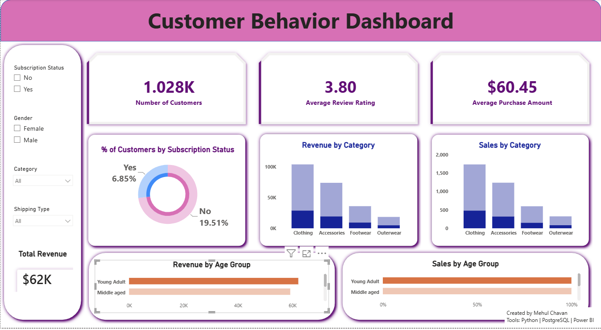
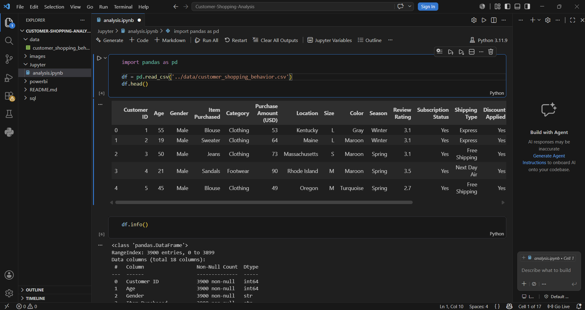
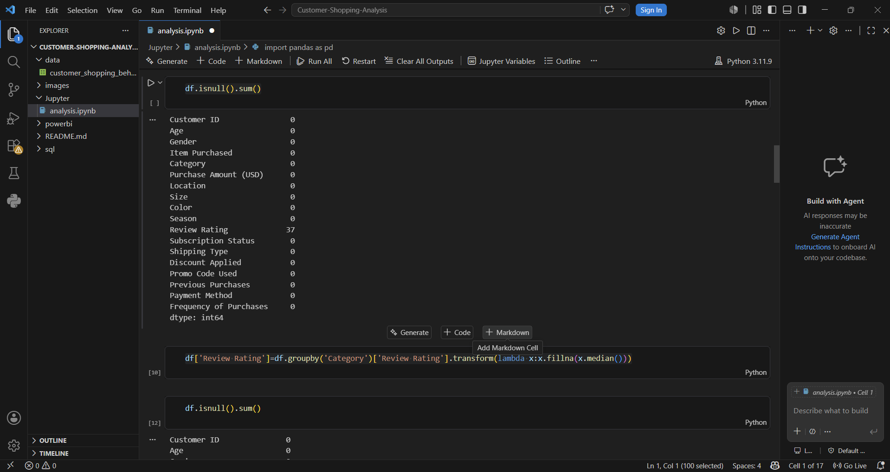
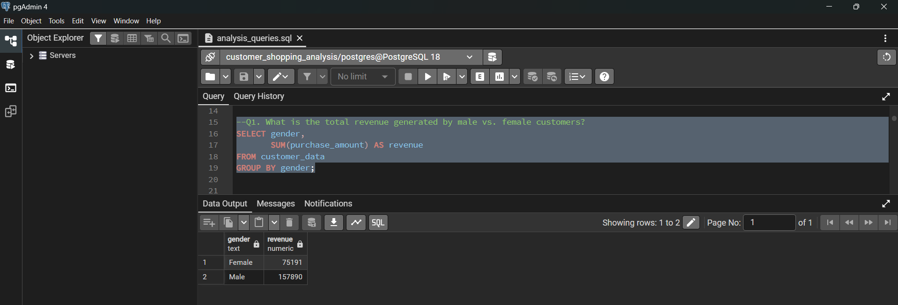
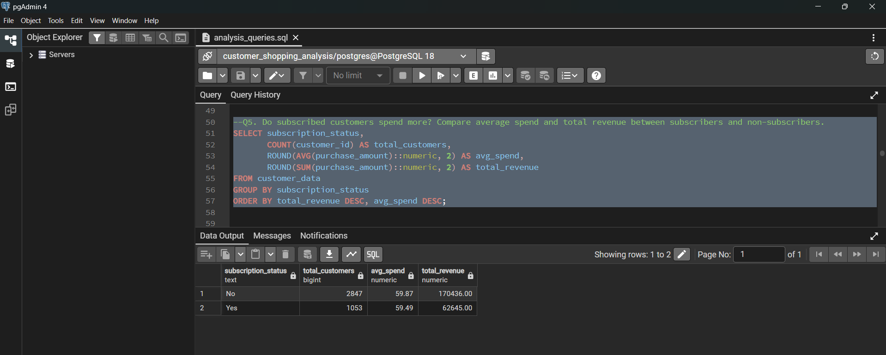

# Customer Shopping Analysis

## Overview

This project is an end-to-end Data Analytics solution focused on analyzing customer shopping behavior. The workflow includes data cleaning, exploratory data analysis (EDA), database integration, SQL-based business analysis, dashboard development, and reporting.

The objective is to extract meaningful insights from customer purchase data and present them through an interactive Power BI dashboard for data-driven decision-making.

---

## Dataset

The dataset contains customer shopping information, including:

- Customer demographics
- Product categories
- Purchase amounts
- Review ratings
- Subscription status
- Discount usage
- Shipping methods
- Previous purchases
- Seasonal shopping trends

The dataset was initially loaded and analyzed using Python before being stored in PostgreSQL for SQL analysis.

---

## Tools & Technologies

### Programming & Analysis
- Python
- Pandas
- NumPy
- Jupyter Notebook / VS Code

### Database
- PostgreSQL
- SQL

### Visualization
- Power BI

### Reporting
- Gamma
- Microsoft PowerPoint

### Version Control
- Git
- GitHub

---

## Project Workflow

CSV Dataset  
↓  
Python (Data Cleaning & EDA)  
↓  
PostgreSQL Database  
↓  
SQL Analysis  
↓  
Power BI Dashboard  
↓  
Business Insights & Reporting

---

## Project Steps

### 1. Data Loading
- Imported CSV dataset into Python.
- Performed initial data inspection.

### 2. Data Cleaning
- Handled missing values.
- Standardized data formats.
- Removed inconsistencies.

### 3. Exploratory Data Analysis (EDA)
- Customer behavior analysis.
- Product performance analysis.
- Revenue trend analysis.
- Purchase pattern analysis.

### 4. Database Integration
- Created PostgreSQL database.
- Loaded cleaned data into PostgreSQL.
- Structured data for SQL querying.

### 5. SQL Analysis
Performed business-focused SQL queries including:

- Revenue analysis by gender
- Top-rated products
- Customer segmentation
- Subscriber vs non-subscriber analysis
- Discount impact analysis
- Revenue contribution by age groups

### 6. Dashboard Development
Built an interactive Power BI dashboard featuring:

- KPI Cards
- Revenue Analysis
- Product Analysis
- Customer Analysis
- Age Group Analysis
- Interactive Filters and Slicers

### 7. Reporting
- Generated business insights.
- Created presentation-ready reports and visualizations.

---

## Dashboard Features

### KPIs
- Total Revenue
- Total Customers
- Average Review Rating
- Average Purchase Amount

### Visualizations
- Revenue by Category
- Sales by Category
- Revenue by Age Group
- Sales by Age Group
- Subscription Status Analysis

### Filters
- Gender
- Category
- Subscription Status
- Shipping Type

---

# Dashboard Preview



---

# Python Analysis





---

# SQL Analysis





---

## Key Insights

- Clothing category generated the highest revenue.
- Young adults contributed the largest share of revenue.
- Non-subscribers represented the majority of customers.
- Customer spending patterns varied across product categories.
- Discounts significantly influenced purchasing behavior.

---

## Results

The project successfully transformed raw customer data into actionable business insights through:

- Data Cleaning
- Exploratory Data Analysis
- SQL-Based Analysis
- Dashboard Development
- Business Reporting

The final solution demonstrates the complete analytics lifecycle from raw data to business intelligence reporting.

---

## Project Structure

```text
customer-shopping-analysis/
│
├── Customer_Shopping_Analysis.pbix
├── analysis.ipynb
├── analysis_queries.sql
├── README.md
│
└── images/
    ├── dashboard.png
    ├── codePart1.png
    ├── codePart2.png
    ├── codePart3.png
    ├── codePart4.png
    ├── querySample1.png
    ├── querySample2.png
    ├── querySample3.png
    └── querySample4.png
```

## How to Run

### Python Analysis

1. Install required libraries:
   - pandas
   - numpy
   - matplotlib

2. Open the notebook:

```bash
jupyter notebook analysis.ipynb
```

3. Run all cells.

### Database Setup

1. Create a PostgreSQL database.
2. Import the cleaned dataset.
3. Execute SQL queries from:

```text
analysis_queries.sql
```

### Power BI Dashboard

1. Open:

```text
Customer_Shopping_Analysis.pbix
```

2. Refresh the data connection.
3. Interact with filters and dashboard visuals.

---

## Author

**Mehul Chavan**

Data Analytics | SQL | Python | PostgreSQL | Power BI

GitHub: https://github.com/mehulchavan11
